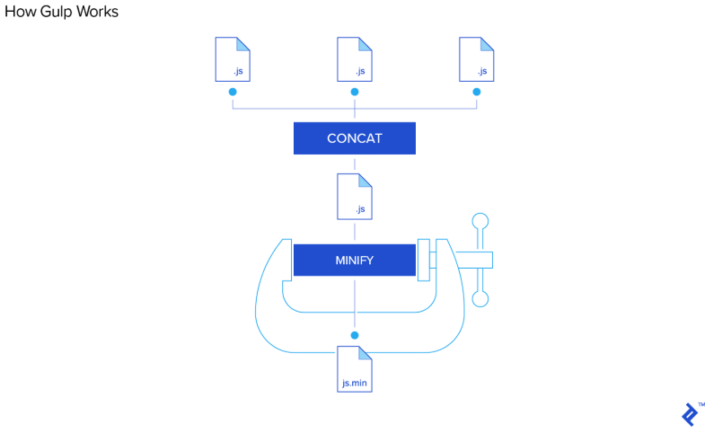
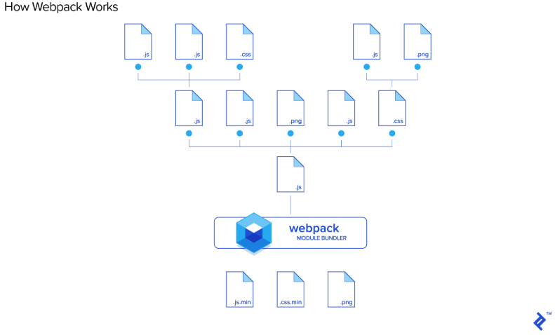
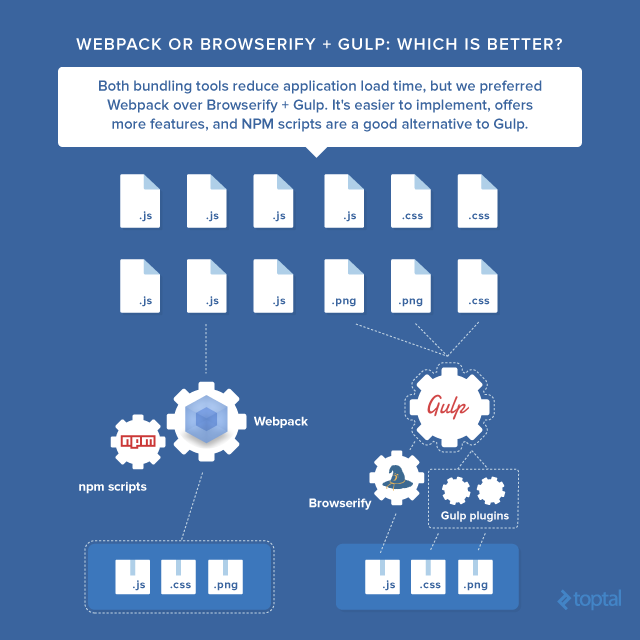

# Task runner vs Webpack

- task runner
  

- webpack
  

- webpack은 모든 리소스들(javascript, css, images, fonts, etc)에 대한 dependency graph를 생성하여 빌드시켜주는 도구
- Grunt, Gulp는 오로지 리소스들에 대한 툴로 사용되며 dependency graph에 대한 개념이 없습니다.

  

## 참고 자료

- [Webpack or Browserify & Gulp: Which Is Better?](https://www.toptal.com/front-end/webpack-browserify-gulp-which-is-better)
- [이해하기 쉬운 Webpack 가이드](https://haviyj.tistory.com/17)
